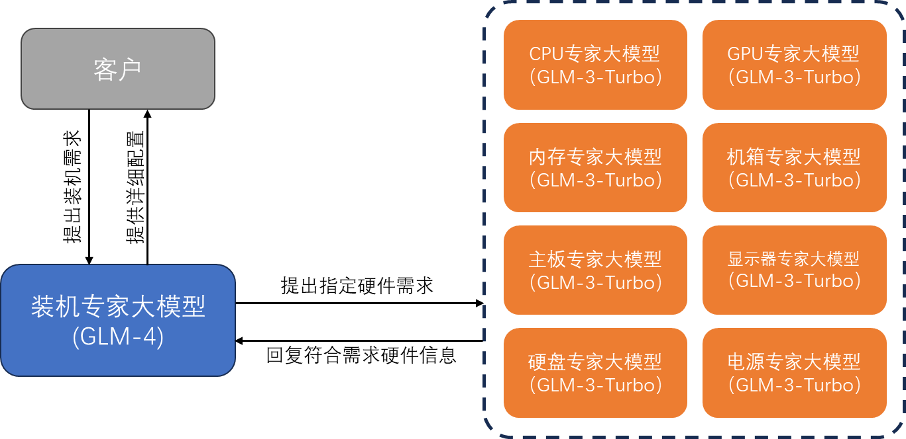

# 智能装机系统

## 项目简介

当前的通用大模型具有良好的知识储备，对于台式机装机有足够的了解。然而，由于大模型信息更新的成本较高，主流的通用大模型常常无法保证内容的时效性。装机市场中各类硬件的更新频率相对较快，且价格的变化较为敏感，因而在获取装机信息的过程中要保证时效性。

针对这一主要的问题，我们构建了一套利用不同规模的大模型智能体组合而成的装机推荐系统。该推荐系统的智能体主要由两种规模的大模型组成，包括用于模拟装机专家的规模较大的大模型，以及用于模拟硬件专家的规模较小的大模型。装机专家大模型会根据客户的需求，合理分配各硬件的成本分布，并通过反复询问硬件专家得到符合相应硬件条件的详细信息，包括这些型号及其对应的配置、价格。硬件专家大模型相对规模较小，因而用于了解当前不同硬件的价格信息，并通过这类信息为装机专家提供准确的辅助。

## 项目结构

- `spider/`：实时爬取硬件信息
- `CCGPT/`：装机推荐系统
  - `GPT.py`：装机专家大模型
  - `Assistant.py`：硬件专家大模型
  - `CCGPT.py`：装机推荐系统

## 使用方法

1. 运行`spider/page_spide.py`，爬取硬件信息及实时价格
2. 运行`main.py`，输入需求，获取推荐结果
3. 推荐过程中如果询问客户有无进一步的需求，可视情况进行回复